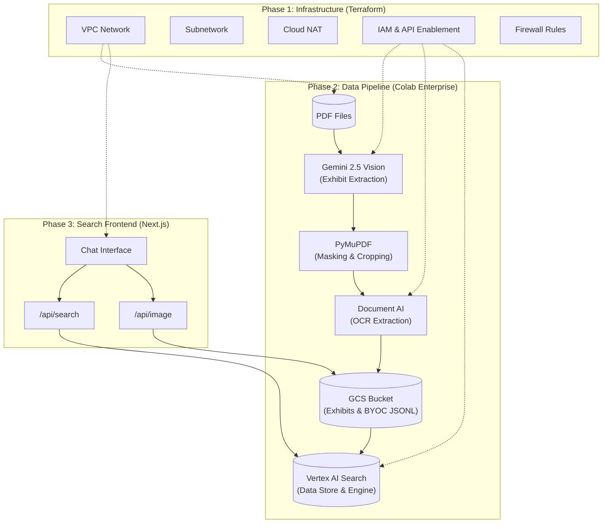

# System Architecture

This document describes the high-level architecture of the Colab Enterprise Experiments repository.

## Overview

The system is composed of three main phases: Infrastructure Provisioning, Multimodal Data Processing, and the Search Frontend.

## Component Details

### 1. Infrastructure (Terraform)
- **VPC & Subnet**: Isolated network environment for Colab Enterprise runtimes.
- **Cloud NAT & Router**: Provides outbound internet access for private runtimes.
- **IAM**: Grants the default Compute Engine service account the necessary permissions for Document AI, Vertex AI, and Cloud Storage.

### 2. Data Pipeline (Notebooks)
- **Spatial Extraction**: Gemini 2.5 identifies charts/graphs and returns bounding boxes.
- **Visual Grounding**: PyMuPDF creates crops of identified exhibits.
- **BYOC Ingestion**: Custom chunks containing text, metadata, and base64 blob images are ingested into Vertex AI Search.

### 3. Frontend (Next.js)
- **Citations**: The Answer API returns grounded citations with references.
- **Image Proxy**: An authenticated API route fetches exhibit images directly from GCS to ensure security.
